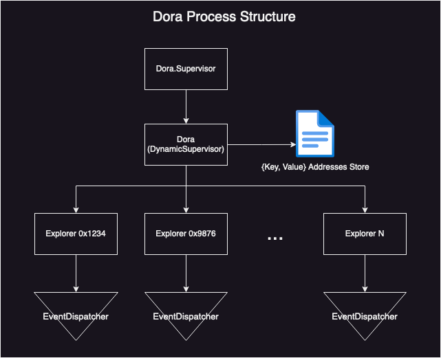
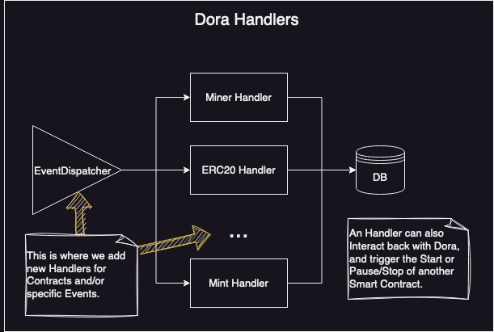
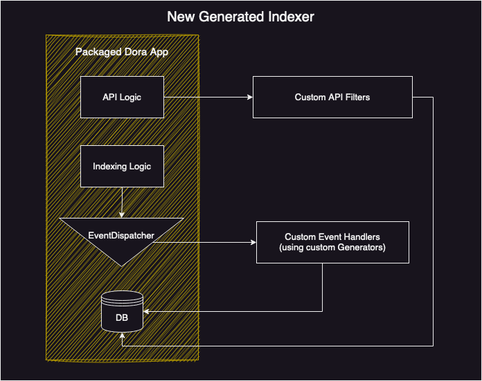

# Dora, the TipsetExplorer


Indexing of blockchain events is crucial for dApps as it enables quick and efficient access to relevant data stored on the blockchain, which is required for executing Smart Contracts and providing a seamless user experience. Without indexing, the process of searching and retrieving data from the blockchain would be slow and cumbersome, negatively impacting the functionality and usability of dApps. This way, there are services like [The Graph](https://thegraph.com/en/), that make it easy for developers to start indexing these Events, on-demand. 

This project, **Dora, The TipsetExplorer**, is a [The Graph](https://thegraph.com/en/)-like event indexer, for the FEVM, where you specify Handlers (files writen/generated in Elixir that instruct `Dora` on how to deal with events) by Smart Contract or **default** Handlers for a specific Event. 

At the moment there is nothing similar to this Project working on FEVM (Hyperspace, at least), so we decided to build our own.

This project is part of the [Space Warp hackathon by ETHGlobal](https://ethglobal.com/events/spacewarp).

Example deployed at [dora-the-tipset-explorer.fly.dev/](https://dora-the-tipset-explorer.fly.dev/)

You can query by replacing `:type` with an indexed Event/Projection type:
 - `events` at [dora-the-tipset-explorer.fly.dev/api/events/:type](https://dora-the-tipset-explorer.fly.dev/api/events/:type) and add any query params to filter. (example type: `new_broker_deployed`)
 - `projections` at [dora-the-tipset-explorer.fly.dev/api/projections/:type](https://dora-the-tipset-explorer.fly.dev/api/projections/:type) and add any query params to filter. (example type: `loan`)
 
### Features

This Indexer has some interesting built-in features that are very helpful for maintaining these types of services.

- Index Smart Contracts **on demand**;
- Each Smart Contract has **its separate Process** to handle Indexing.
- Fault tolerance at the Process/in-memory level. If a process responsible for Indexing a specific smart contract, crashes, **there is a Supervisor Process that will try to re-spawn it** and continue where it left off.
- Fault tolerance in case of a full crash of `Dora`. It takes advantage of a `{key, value}` store in a local file. **If the whole app crashes, when restarting the server, previously running processes for each Smart Contract, will be started and resume at the same Event they were before**. This ensures that no Events are lost during the downtime. If this file also fails us, `Dora`, will look for this information in its local Database. This way, it has 3 different mechanisms for recovery.
- Easily **Pause and Stop indexing a Smart Contract**.
- **Plug and Play Event Handlers** by Smart Contract address or Default Handlers for an Event type.
- **Automatic code generation** for new Handlers.
- **Abstracted Event Data/Arguments decoding**. Delt by each `Explorer` process.
- **Abstracted Database tables** under `Events` and `Projections`, that enable you to store full `Maps` and query by their values.
- Simple to use API, with just two main endpoints (`api/events/:type` and `api/projections/:type`).

<p align="center">
  
</p>

Note: The `EventDispatcher` is not a specific process, just a Module that each `Explorer` can call. Each `Explorer` is a separate process, which makes the `EventDispatcher` functions run inside the calling process.

## Setup and Local Development

`bin/setup` to install the necessary dependencies for the project to work. It will also set you up with a Postgres Database.

`bin/server` after the setup, and you should be good to go!

## Start indexing new Smart Contracts

After starting the server, a new `iex` console will be running. There, you can interact with the Indexer, the way you want.

`Dora.start_explorer_instance("0x1234", abi_path)`, with a valid address and ABI, to start exploring this Smart Contract. It's recommended to have ABIs under `priv/abis` so that they are also accessible within the deployed version, easily.

Example: `Dora.start_explorer_instance("0xf6e24c5e9abcaca61c9478c9b7117db86ff2011f", "priv/abis/erc721.json")`

However, if you run this, after a couple of seconds, there's a chance you start to see the warning below. This is because we haven't specified a Handler for that Event (in other words, it means that the indexer doesn't know what to do with it, and therefore is ignoring those events). Ignoring the events, just means that they are not being stored in the Database, and `Dora` is still keeping track of them. Supposing the App/Server would go down when recovering `Dora` would already know about these ignored events.

```text
[warning] Ignoring event transfer from 0xf6e24c5e9abcaca61c9478c9b7117db86ff2011f.
```

### What's an Event Handler?

Event Handlers are the specification on how to deal with a newly detected Event. Each Event emitted by a Smart Contract has its arguments, and there's a chance that it requires some type of custom handling. There are also some events that we don't want to store because they don't have any useful use for our dApp.

The first thing we need to do is to add the pattern match for that Event in `Dora.EventDispatcher`. With this Dispatcher, we can separate on how to deal with `Events` per Smart Contract or even have a catch-all Handler. Looking at the code below, if `Dora` detected a new `Transfer` Event from `0x1234` it'd call the `ERC20` Handler, if it was from `0x9876` it'd call the `ERC721` Handler. Finally, if it still was a `Transfer` Event, but from none of those specific Smart Contracts (but still from one that `Dora` is indexing), it'd call the default handler specified for `Transfers`.

**The `EventDispatcher` module already receives events decoded**.

```elixir
defmodule Dora.EventDispatcher do
  # (...)
 
  def handle("transfer", "0x1234", event) do
    Dora.Handlers.Contracts.ERC20.apply("transfer", "0x1234", event)
  end

  def handle("transfer", "0x9876", event) do
    Dora.Handlers.Contracts.ERC721.apply("transfer", "0x9876", event)
  end
 
  def handle("transfer", address, event) do
    Dora.Handlers.Defaults.Transfer.apply(address, event)
  end

  # (...)
end
```

Next, we need to define each handler under `Dora.EventDispatcher`. Let's just look at a simple example for now. The following code block represents how the **Default** Handler for a `Trasnfer` could look. It retrieves the Event's arguments from `topics` and just stores a new `Transfer` Event in the Database.

```elixir
defmodule Dora.Handlers.Defaults.Transfer do
  require Logger

  alias Dora.{Events, Repo}
  alias Dora.Handlers.Utils

  def apply(address, {_function, topics}) do
    topics_map = Utils.build_topics_maps(topics)

    transfer = %{
      from: topics_map["from"],
      to: topics_map["to"],
      id: topics_map["tokenId"]
    }

    Events.create_event(%{
      event_type: "transfer",
      contract_address: address,
      event_args: transfer
    })
  end
end
```

Also, note that you don't need to worry about the Database Schema here. `event_args` can be any `Map`.

<p align="center">
  
</p>

### `Projections` and other actions

We already hinted the concept of `Projections`, but lets explain what they represent. A projection corresponds to the aggregate state of several `Events`. For example, with `transfer` events from an `ERC721` contract, we could have an `nft` projection. This projection could represent token information, like the current owner. This way, if there are several `transfer` Events for the same `Token ID`, the projection would be only one entry in the Database per `nft` (token id), and would store the current owner address. (If you use our generators, described below, you'll have more information on how to use `Projections` there.)

With `Dora` we can create any type of projection, identifying it by `type`, `id` and `smart contract`, and storing the additional fields we want under `projection_fields`.

It's also possible for an Handler to also interact back with `Dora`, and trigger the Start or Pause/Stop of another Smart Contract. This way, the Indexer can grow dinamically, if our use case has a Contract Factory or similar, for example.

### Re-indexing Events/Stop a Smart Contract from being indexed

There's a file called `addresses`, that keeps track of the messages that it has indexed already, for each Smart Contract. This way, if you stop and re-run the server, it will resume from where it stopped, and not from the beginning (if you want to replay stuff locally, just delete the file entirely -> a new one is created automatically). For example, you had some events being ignored because your Handler had some issues, and to have them indexed properly you'd have to go through this process.

To stop an address from being indexed and removed from the `addresses` file, you can also do `Dora.stop_explorer_instance(address)`.

In both situations, just call `start_explorer_instance` to start from scratch again.

### Pausing a Smart Contract indexing

It's also possible to pause a specific Smart Contract from being indexed. Several reasons could require this, and it's as simple as running `Dora.pause_explorer_instance(address)`. If you run the start function again after this, `Dora` will resume indexing Events for that Contract, at the exact place it was when you paused.

## Generating new Event Handlers

If you're not very familiar with Elixir there's a common concept of developing code generators. These generators are supposed to be used by less experienced devs, that want to try out something very quick, or by fully experienced ones that don't want to deal with boilerplate code.

This way we created our generators to help in the creation of new Event Handlers. It requires the first argument to be the `Contract` or specific `Event` name, and the ABI path to be present. If you don't pass `contract:AN_ADDRESS` in the command, then the generator will look for that `Event` name in the ABI, and only generate the handler for it. If, in this case, names don't match, nothing will be generated.

```bash
 # Generating a new Handler for a specific Contract
 $ mix dora.gen.handler ERC20 contract:0x1234 abi:priv/abis/erc20.json

 # Generating a new default Handler for a specific Event (regardless of contract address)
 $ mix dora.gen.handler Transfer abi:priv/abis/erc721.json
```

For example, the first command will create a new file `lib/dora/handlers/contracts/erc20.ex`, and it will go through all Events present in the ABI and automatically inject the respective code for pattern matches in `lib/dora/event_dispatcher.ex` (as we saw above).

The new Handler file already comes with a bunch of code, that you can customize at your will, without needing to deal with setting up things and boilerplate code.

## Next Steps

There are, already, a couple of ideas in the pipeline, that we believe would be a great addition to this Project and the FEVM as a whole. Below, we can see some of them.

### Generating a new Indexer App

The concept of Generators is something that we can explore further with `Dora`, and the icing on the cake for this project to be used by other Builders would be to abstract all logic that it's not Handler related and that the Developer doesn't need to worry about. For example, when building subgraphs in [The Graph](https://thegraph.com/en/), you don't need to worry about the protocol internals, just that you need to specify your schemas and respective Handlers. 

This way, we could take advantage of generators (something like `mix dora.new`), and build a `Dora installer`, that would create a new Elixir App, with all the base structure ready to be deployed, and using the original `Dora` app as a dependency. This is a lot better than having this project as a `Github Template`, for example, as you don't even need to know what's behind it.

You can think of this installer to something like `yarn create next-app`. You also don't know what's happening with its internals.

<p align="center">
  
</p>

The image above tries to represent that with this approach, you'd just need to develop your own Event Handlers (that can also be automatically generated, using the `dora.gen.handler`), and custom API filters to enhance the basic ones, already packaged within `Dora`.

This part is being handled in the `zdv/dora-installer` branch.

### Auth mechanism

To avoid being spammed with unwanted requests, there is also a plan to add some kind of authentication to HTTP requests, using an API Key, or something similar. We can also base ourselves in **The Graph**, and add a tokenized system/protocol that would enable you to query any `Dora Indexer`, paying a fee per request to the Indexer Owner, for example.

### Storing Indexed Events in Filecoin/IPFS

Somewhat related to the previous topic and the tokenization of the system, instead of relying on Centralized Databases to store Events, in the future these should be stored under the Filecoin Network, IPFS, or a related on-chain service.

### Adding Tests

As this started out as an Hackathon Project it doesn't have tests. (Time is short in an Hackathon). While we work on it, and add tests, use this project at your own risk.
